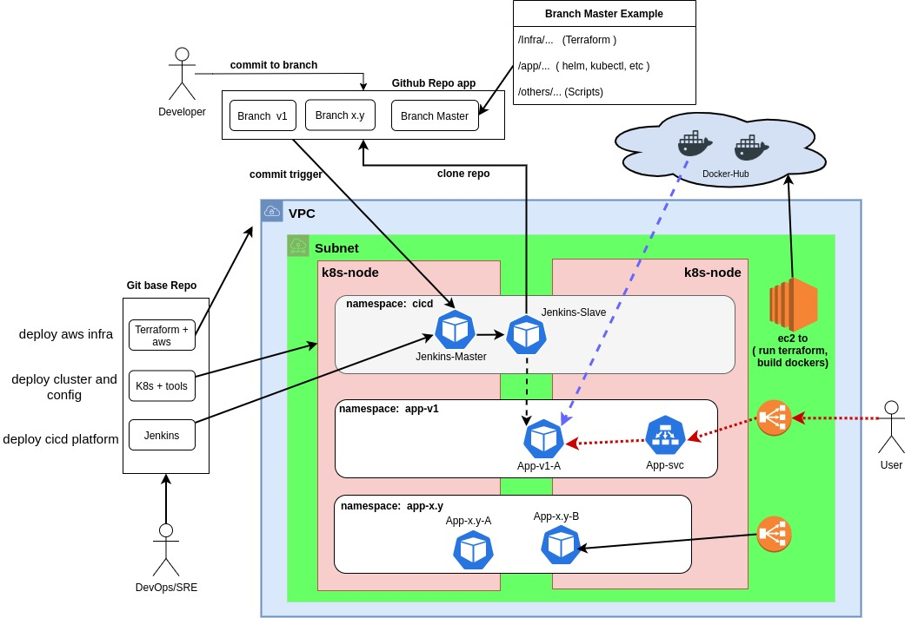
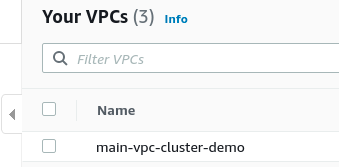
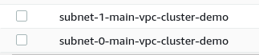
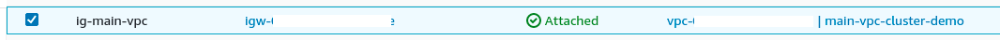
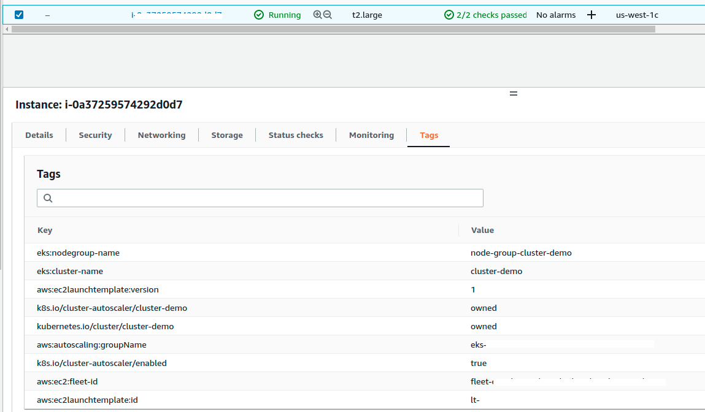
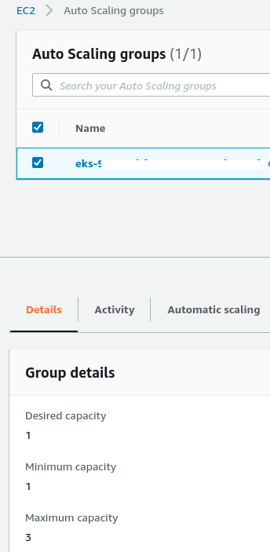
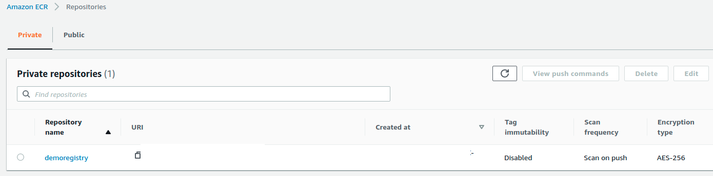

# Terraform + Kubernetes + Jenkins  (PoC)

 
 

## Objetive
 - Create a simple and fast environment to work with a generic life cycle.. 
 - Deploy base infra with Terraform  (VPC, Subnet, SG, EKS, ECR).
 - Deploy a kubernetes cluster (eks) in AWS, to use as a base work environment.
 - Deploy Jenkins with minimun configs to start working.

 
 

## Prerequisites
|name         | version | url   | obs      |
| ---         | ---     |   --- |  ---     |
| linux(apt)  |    -    |   -   | curl jq  |
| aws-cli     | v2.0.x  |https://docs.aws.amazon.com/cli/latest/userguide/getting-started-install.html | - |
| aws-iam-authenticator   | v0.5.0  |https://docs.aws.amazon.com/eks/latest/userguide/install-aws-iam-authenticator.html | - |
| eksctl      | v0.91.x |https://docs.aws.amazon.com/eks/latest/userguide/eksctl.html | - |
| helm        | v3.7.x  |https://helm.sh/docs/intro/install/ | - |
| kubectl     |client(1.22)  server(1.19) | https://kubernetes.io/docs/tasks/tools/install-kubectl-linux/ | - |
| terraform   | v1.1.9  |https://learn.hashicorp.com/tutorials/terraform/install-cli | - |
| Python      | v3.7.x  |   -   | Optional |
| Docker      | v20.10.x|   -   | Optional |

 
 

## Disclaimer
- This is a demo of how to deploy a bassic kubernetes cluster in aws using Terraform and Helm to deploy a Jenkins server.
- This is the first and minimun version ( a PoC )
- Security aspect were not taken into account
- I prefer deploy all in my cluster to maintain Git like a Single Source of truth (SSoT), and maintain separate my code of my real environments. Of I loss my environment, its not affect (loss) my code too  ;) 

 

## Personal recommendation    ;) 
- You can build your own docker container with all "Prerequisites" to avoid install it for all employees. After build they can pull this container and work all with the same environment.
- For test, try to use SPOT instances, it's cheaper!!!

 
 

## Design

 

 
  

# Deploy

 

### Configure your aws-cli

	cp /home/$(whoami)/.aws/config{,_bkp} # bkp original file 
	echo -e "[profile MyProfile] \
		\n role_arn=AAAAAAAAAAAAAAAAAAAAA \
		\n source_profile=default \
		\n region=CCCCCCC" > /tmp/1111  # > /home/$(whoami)/.aws/config

	cp /home/$(whoami)/.aws/credentials{,_bkp} # bkp original file 	
	echo -e "[default] \
		\n aws_access_key_id=AAAAAAAAAAA \
		\n aws_secret_access_key=BBBBBBBBBBB \
		\n region=CCCCCCC" > /tmp/2222 # > /home/$(whoami)/.aws/credentials

###  Infrastructure

	terraform init  	# to download all requirements and modules
	terraform plan  	# Optional, to see what will you do before apply
	terraform apply 	# Go for a coffee, this take a few minutes

### Generate a kubeconfig for new cluster
<pre>
mv /home/$(whoami)/.kube/config  /home/$(whoami)/.kube/config_bkp
aws --profile MyProfile eks --region $(terraform output region|jq -r .) update-kubeconfig --name $(terraform output cluster-name|jq -r .)
</pre>

### Check if you can show all ns 
<pre>
kubectl get ns
	NAME              STATUS   AGE
	default           Active   11m
	kube-node-lease   Active   11m
	kube-public       Active   11m
	kube-system       Active   11m
</pre>

 
 

# Ingress Controller and ALBs for aws  (to manage LBs from kubernetes )

### Asociate the OIDC iam to cluster  (need to install eksctl)
<pre>
eksctl --profile MyProfile  utils associate-iam-oidc-provider  --region $(terraform output region|jq -r .) --cluster $(terraform output cluster-name|jq -r .) --approve
	[ℹ]  eksctl version 0.91.0
	[ℹ]  using region us-west-1
	[ℹ]  will create IAM Open ID Connect provider for cluster "cluster-demo" in "us-west-1"
	[✔]  created IAM Open ID Connect provider for cluster "cluster-demo" in "us-west-1"
</pre>

### Download policy
<pre>
  curl -o iam-policy.json https://raw.githubusercontent.com/kubernetes-sigs/aws-load-balancer-controller/v2.4.1/docs/install/iam_policy.json
</pre>

### Create new policy to manage LBs
<pre>
aws --profile MyProfile iam create-policy --policy-name AWSLoadBalancerControllerIAMPolicy --policy-document file://iam-policy.json
	{
	    "Policy": {
	        "PolicyName": "AWSLoadBalancerControllerIAMPolicy",
	        "PolicyId": "CCCCCCCCCCCCCC",
	        "Arn": "arn:aws:iam::99999999999:policy/AWSLoadBalancerControllerIAMPolicy",
	        "Path": "/",
	        "DefaultVersionId": "v1",
	        "AttachmentCount": 0,
	        "PermissionsBoundaryUsageCount": 0,
	        "IsAttachable": true,
	    }
	}
</pre>

### Create a serviceAccount (to manage permissions in the cluster )
<pre>
  eksctl --profile MyProfile create iamserviceaccount --cluster=$(terraform output cluster-name|jq -r .) --namespace=kube-system --name=aws-load-balancer- controller --attach-policy-arn=arn:aws:iam::9999999999:policy/AWSLoadBalancerControllerIAMPolicy --override-existing-serviceaccounts --region   $(terraform output region|jq -r .) --approve
  	[ℹ]  eksctl version 0.91.0
  	[ℹ]  using region us-west-1
  	[ℹ]  1 existing iamserviceaccount(s) (kube-system/aws-load-balancer-controller) will be excluded
  	[ℹ]  1 iamserviceaccount (kube-system/aws-load-balancer-controller) was excluded (based on the include/exclude rules)
  	[!]  metadata of serviceaccounts that exist in Kubernetes will be updated, as --override-existing-serviceaccounts was set
  	[ℹ]  no tasks
</pre>

### Deploy ingress controller 

	kubectl apply -f 02-ingress/alb-ingress-controller.yaml

### Deploy hpa and autoscaler

	kubectl apply -f 01-hpa_and_autoscaler/components.yaml

### Check metrics  (in some cases it takes a few minutes.)
	kubectl top pods -n kube-system
		NAME                              CPU(cores)   MEMORY(bytes)   
		aws-node-dxvl6                    4m           40Mi            
		coredns-9747b5cfd-qtkpq           2m           8Mi             
		coredns-9747b5cfd-szj7r           2m           8Mi             
		kube-proxy-6swwn                  1m           12Mi            
		metrics-server-6594d67d48-qpffc   3m           16Mi 

 
 

# CICD

### Add helm repo
	helm repo add jenkins https://charts.jenkins.io

### Create namespace for cicd 
	kubectl create namespace jenkins-demo

### Get last values
	helm show values jenkinsci/jenkins > 03-cicd/jenkins-k8s.yaml

### Edit and deploy jenkins
	helm -n jenkins-demo install jenkins jenkinsci/jenkins -f 03-cicd/jenkins-k8s.yaml

### Get secret access (wait to pod finish and start)
	kubectl exec -n jenkins-demo jenkins-demo -it svc/jenkins -c jenkins -- /bin/cat /run/secrets/chart-admin-password && echo

### Forward port (for this test I use port-forward, but I could use a Load Balancer to expose this service)
	kubectl -n jenkins-demo port-forward svc/jenkins 8080:8080

### To delete all
	helm -n jenkins-demo delete jenkins 

 
 

## Registry

<pre>
  ### vars
  GROUP=devops
  registry-endpoint=999999999.dkr.ecr.$region.amazonaws.com
</pre>

### Login with you actual user (need to have   .aws/config and .aws/secrets )
<pre>
  aws ecr get-login-password --region $(terraform output cluster-name|jq -r .) | docker login --username AWS --password-stdin $registry-endpoint
</pre>

###  Crear repo
<pre>
  aws ecr create-repository --repository-name $GROUP/[nombre_de_tu_nueva_imagen] --image-scanning-configuration scanOnPush=true --region $region
</pre>

###  Taggear la nueva imagen
<pre>
  docker tag [imagen_original_buildeada] $registry-endpoint/$GROUP/[nombre_de_tu_nueva_imagen]:[TAG]
</pre>

###  Pushear
<pre>
  docker push $registry-endpoint/$GROUP/[nombre_de_tu_nueva_imagen]
</pre>

 
 

### Terraform code design
<pre>
For this example you can change and use your oun vars in variables.tf.
This vars file was used to avoid modify all code and generate a custom names for al resources.
(Used like "easy human frendly read" instead of using only objects ID).

For example, you can see "VPC Name", its a compound word (or "compound name"). And the same for Subnet Names.
This is super usefull when you have some resources in the same location to different environments or projects.

VPC name example:
	vpc.tf#L18   ==  variables.tf#L18 + variables.tf#L8

Subnet name example:
	vpc.tf#L18 ==  vpc.tf#L24 + variables.tf#L18 + variables.tf#L8

</pre>

 
	
	 
 
	
	 
 
	
	 
 
	
	 
 
	
	 
 
	
	 
 
	
	 
 

  
  

refs:
<pre>
https://kubernetes-sigs.github.io/aws-load-balancer-controller/v2.4/deploy/installation/
https://docs.aws.amazon.com/es_es/eks/latest/userguide/enable-iam-roles-for-service-accounts.html
https://docs.aws.amazon.com/eks/latest/userguide/service_IAM_role.html
https://docs.aws.amazon.com/es_es/vpc/latest/userguide/vpc-dns.html
https://registry.terraform.io/
https://plugins.jenkins.io/
</pre>

